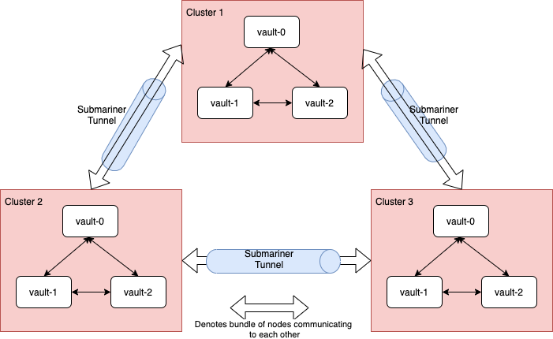

# Vault
## Introduction
The vault deployment is taken in part from the [openshift-modern-availabilty] collection of openshift applications and tools. Modifications have been made to automate it through gitops and fit the OTP pattern.

Vault is primarly being used to provide a key-value store for secrets, used in conjunction with the external-secrets tool allows for secrets to be centralised in cloud provider agnostic and decentralised method. The vault installation is setup to be deployed on 3 (this could be increased) fixed pre-determind clusters. ideally a cluster would be placed in each cloud provider to cover of an outage in the other provider.

Each cluster has 3 vault nodes running, in total there are 9 vault nodes running and communicating with eachother.

Data is stored in each persistent volume, attached to each node.

## Communications
The deployment takes advantage of submariner (also part of the OTP pattern) to create Layer 3 tunnels using IPSec to create a secrure and consistent (in naming and behaviour) connection between clusters.

The Vault nodes are configured in a mesh, i.e all nodes talking to all nodes.

## TLS
TLS certificates are used between each node. Their creation is handled by a local intance of cert-manager, that is acting as an intermediate CA for that cluster and namespace. Refer to the cert-manager [README.md] for more detials.

## Values File
There is a comprehensive values file that is part of the deployment, the config section will need to be updated for the deployment as currently that is not automated. 

## Config
What needs to be updated is leader_api_addrs with the address of each vault instance, this can be predetermined before deployment, the same config file for each deployment.

[openshift-modern-availability]: https://github.com/raffaelespazzoli/openshift-modern-availability/blob/master/establishing-trust.md
[README.md]: https://github.com/nickmerrett/otp-gitops-services/tree/master/instances/cert-manager